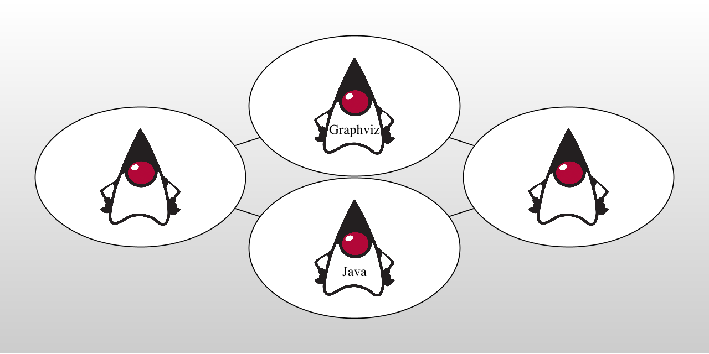
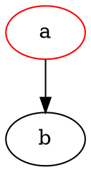

# graphviz-java 
[](https://travis-ci.org/nidi3/graphviz-java)
[](https://codecov.io/gh/nidi3/graphviz-java)
[](https://opensource.org/licenses/Apache-2.0)
[](https://maven-badges.herokuapp.com/maven-central/guru.nidi/graphviz-java)
[](https://github.com/sponsors/nidi3)

Use graphviz with pure java. Create graphviz models using java code and convert them into nice graphics.

#### [How it works ](#user-content-how-it-works)
#### [Prerequisites ](#user-content-prerequisites)
#### [API ](#user-content-api)
#### [Parsing ](#user-content-parsing)
#### [Examples ](#user-content-examples)
#### [Images ](#user-content-images)
#### [Configuration ](#user-content-configuration)
#### [Javadoc ](#javadoc)
#### [Sketchy ](#sketchy)


## How it works
To execute the graphviz layout engine, one of these options is used:
- If the machine has graphviz installed and a `dot` command is available, spawn a new process running `dot`.
- Use this [javascript version](https://github.com/mdaines/viz.js) of graphviz and execute it on the V8 javascript engine.
This is done with the bundled [J2V8](https://github.com/eclipsesource/J2V8) library.
- Alternatively, the javascript can be executed on Java's own Nashorn or GraalVM engine (preferring Graal if both are available).

The method(s) to be used can be configured with the `Graphviz.useEngine()` method. 

## Prerequisites

This project heavily uses classes from `java.awt`. Therefore, **it does not work on android.**

### Maven

This project is available via Maven:

```xml
<dependency>
    <groupId>guru.nidi</groupId>
    <artifactId>graphviz-java</artifactId>
    <version>0.18.1</version>
</dependency>
```

`graphviz-java` contains all needed dependencies including one to `J2V8` for the current platform (Linux, Mac OS X, Windows). 
This should be ok for most use cases. 
  
**gradle does not support this way of defining a dependency.** Gradle users have to manually add a dependency to J2V8,
e.g. `com.eclipsesource.j2v8:j2v8_linux_x86_64:4.6.0`

Instead of `graphviz-java` there are two alternative dependencies that can be used: 
- `graphviz-java-all-j2v8` additionally contains dependencies to _all_ `J2V8` platforms. 
    So the same application can run on Linux, Mac OS X and Windows.  
- `graphviz-java-min-deps` contains only dependencies that are absolutely necessary. 
    All other dependencies are marked as `optional` and must added manually. See the [pom.xml](graphviz-java-min-deps/pom.xml#L64-L90) for details.
    
Instead of `J2V8`, one can also use the JDK javascript engine Nashorn.
If Nashorn is too slow or on JDK version 15 or newer (where Nashorn has been removed),
the graal [javascript](https://github.com/graalvm/graaljs) engine is a third option.
It needs this additional dependency:
```xml
<dependency>
    <groupId>org.graalvm.js</groupId>
    <artifactId>js</artifactId>
    <version>20.0.0</version>
</dependency>
```
 
### Logging
Graphviz-java uses the [SLF4J](https://www.slf4j.org/) facade to log. 
Users must therefore provide a logging implementation like [LOGBack](https://logback.qos.ch/)
```xml
<dependency>
    <groupId>ch.qos.logback</groupId>
    <artifactId>logback-classic</artifactId>
    <version>1.2.3</version>
</dependency>
```
or [Log4j](https://logging.apache.org/log4j/2.x/)
```xml
<dependency>
    <groupId>org.apache.logging.log4j</groupId>
    <artifactId>log4j-core</artifactId>
    <version>2.13.0</version>
</dependency>
<dependency>
    <groupId>org.apache.logging.log4j</groupId>
    <artifactId>log4j-slf4j-impl</artifactId>
    <version>2.13.0</version>
</dependency>
```

## API
The API is separated into a mutable and immutable part.
The basic usage is as follows (assuming `import static guru.nidi.graphviz.model.Factory.*`).

### Immutable
[//]: # (basic)
```java
Graph g = graph("example1").directed()
        .graphAttr().with(Rank.dir(LEFT_TO_RIGHT))
        .nodeAttr().with(Font.name("arial"))
        .linkAttr().with("class", "link-class")
        .with(
                node("a").with(Color.RED).link(node("b")),
                node("b").link(
                        to(node("c")).with(attr("weight", 5), Style.DASHED)
                )
        );
Graphviz.fromGraph(g).height(100).render(Format.PNG).toFile(new File("example/ex1.png"));
```
[//]: # (end)


- Global attributes are set using the `graphAttr`, `linkAttr` and `nodeAttr` methods.
- Nodes are styled using the `with` method. 
- To style edges, use the static method `to` which returns a `Link` that also has a `with` method.
- The `with` method accepts predefined attributes like `Style`, `Arrow` or `Shape` 
as well as everything defined in the [Graphviz reference](https://graphviz.gitlab.io/_pages/doc/info/attrs.html)
e.g. `with("weight", 5)` or even arbitrary custom attributes.
- Custom attribute classes can be defined by extending `SingleAttributes` or `MapAttributes`.
 
**Attention:** `Node a = node("a"); a.with(Color.RED);` Is not working as it might be expected. 
All "mutating" methods like `with` on nodes, links and graphs create new objects and leave the original object unchanged.
So in the example above, variable `a` contains a node that is NOT red.
If you want a red node, do `a = a.with(Color.RED)` or use the mutable API.

### Mutable
[//]: # (mutable)
```java
MutableGraph g = mutGraph("example1").setDirected(true).add(
        mutNode("a").add(Color.RED).addLink(mutNode("b")));
Graphviz.fromGraph(g).width(200).render(Format.PNG).toFile(new File("example/ex1m.png"));
```
[//]: # (end)


The mutable API provides similar functions as the immutable one with slightly different syntax:
- `mutGraph` instead of `graph`, `mutNode` instead of `node`
- use setters: `setDirected` instead of `directed`
- `add` instead of `width`  

### Imperative
There is a third possibility to use the API, based on the mutable version.
Its form is closer to the way dot files are written.
In the lambda of the `MutableGraph.use` method, all referenced nodes, links and graphs are automatically added to the parent graph,
without explicitly calling the `add` method. 

[//]: # (imperative)
```java
MutableGraph g = mutGraph("example1").setDirected(true).use((gr, ctx) -> {
    mutNode("b");
    nodeAttrs().add(Color.RED);
    mutNode("a").addLink(mutNode("b"));
});
Graphviz.fromGraph(g).width(200).render(Format.PNG).toFile(new File("example/ex1i.png"));
```
[//]: # (end)
This corresponds to the following `dot` file:



### Kotlin DSL
**Kotlin DSL is still experimental.** Things can change and any feedback is very welcome.

```xml
<dependency>
    <groupId>guru.nidi</groupId>
    <artifactId>graphviz-kotlin</artifactId>
    <version>0.18.1</version>
</dependency>
```

The kotlin DSL based on the imperative API. It defines that following elements:

- `edge`, `node`, `graph` variables to define global attributes.
- `-`, `/`, `[]` operators on MutableNode which link, define ports, set attributes.
- `-`, `/`, `[]` operators on String so that strings can be used directly to define nodes.
- `-`, `[]` operators on Link which allow to chain links and set attributes.  

To enable the functions, use `import guru.nidi.graphviz.*`

[//]: # (kotlin)
```kotlin
graph(directed = true) {
    edge["color" eq "red", Arrow.TEE]
    node[Color.GREEN]
    graph[Rank.dir(LEFT_TO_RIGHT)]

    "a" - "b" - "c"
    ("c"[Color.RED] - "d"[Color.BLUE])[Arrow.VEE]
    "d" / NORTH - "e" / SOUTH
}.toGraphviz().render(PNG).toFile(File("example/ex1.png"))
```
[//]: # (end)


## Parsing

Dot files can be parsed and thus manipulated. Given this file `color.dot`:

```
graph {
    { rank=same; white}
    { rank=same; cyan; yellow; pink}
    { rank=same; red; green; blue}
    { rank=same; black}

    white -- cyan -- blue
    white -- yellow -- green
    white -- pink -- red

    cyan -- green -- black
    yellow -- red -- black
    pink -- blue -- black
}
```


Then running this program:

[//]: # (manipulate)
```java
try (InputStream dot = getClass().getResourceAsStream("/color.dot")) {
    MutableGraph g = new Parser().read(dot);
    Graphviz.fromGraph(g).width(700).render(Format.PNG).toFile(new File("example/ex4-1.png"));

    g.graphAttrs()
            .add(Color.WHITE.gradient(Color.rgb("888888")).background().angle(90))
            .nodeAttrs().add(Color.WHITE.fill())
            .nodes().forEach(node ->
            node.add(
                    Color.named(node.name().toString()),
                    Style.lineWidth(4), Style.FILLED));
    Graphviz.fromGraph(g).width(700).render(Format.PNG).toFile(new File("example/ex4-2.png"));
}
```
[//]: # (end)

results in this graphics:


## Examples

### Complex example

[//]: # (complex)
```java
Node
        main = node("main").with(Label.html("<b>main</b><br/>start"), Color.rgb("1020d0").font()),
        init = node(Label.markdown("**_init_**")),
        execute = node("execute"),
        compare = node("compare").with(Shape.RECTANGLE, Style.FILLED, Color.hsv(.7, .3, 1.0)),
        mkString = node("mkString").with(Label.lines(LEFT, "make", "a", "multi-line")),
        printf = node("printf");

Graph g = graph("example2").directed().with(
        main.link(
                to(node("parse").link(execute)).with(LinkAttr.weight(8)),
                to(init).with(Style.DOTTED),
                node("cleanup"),
                to(printf).with(Style.BOLD, Label.of("100 times"), Color.RED)),
        execute.link(
                graph().with(mkString, printf),
                to(compare).with(Color.RED)),
        init.link(mkString));

Graphviz.fromGraph(g).width(900).render(Format.PNG).toFile(new File("example/ex2.png"));
```
[//]: # (end)


### Example with records
```java
import static guru.nidi.graphviz.attribute.Records.*;
import static guru.nidi.graphviz.model.Compass.*;
```
[//]: # (records)
```java
Node
        node0 = node("node0").with(Records.of(rec("f0", ""), rec("f1", ""), rec("f2", ""), rec("f3", ""), rec("f4", ""))),
        node1 = node("node1").with(Records.of(turn(rec("n4"), rec("v", "719"), rec("")))),
        node2 = node("node2").with(Records.of(turn(rec("a1"), rec("805"), rec("p", "")))),
        node3 = node("node3").with(Records.of(turn(rec("i9"), rec("718"), rec("")))),
        node4 = node("node4").with(Records.of(turn(rec("e5"), rec("989"), rec("p", "")))),
        node5 = node("node5").with(Records.of(turn(rec("t2"), rec("v", "959"), rec("")))),
        node6 = node("node6").with(Records.of(turn(rec("o1"), rec("794"), rec("")))),
        node7 = node("node7").with(Records.of(turn(rec("s7"), rec("659"), rec(""))));
Graph g = graph("example3").directed()
        .graphAttr().with(Rank.dir(LEFT_TO_RIGHT))
        .with(
                node0.link(
                        between(port("f0"), node1.port("v", SOUTH)),
                        between(port("f1"), node2.port(WEST)),
                        between(port("f2"), node3.port(WEST)),
                        between(port("f3"), node4.port(WEST)),
                        between(port("f4"), node5.port("v", NORTH))),
                node2.link(between(port("p"), node6.port(NORTH_WEST))),
                node4.link(between(port("p"), node7.port(SOUTH_WEST))));
Graphviz.fromGraph(g).width(900).render(Format.PNG).toFile(new File("example/ex3.png"));
```
[//]: # (end)


## Images
Images can be included in graphviz in two ways.

One possibility is using the \ tag inside a HTML label:

[//]: # (img)
```java
Graphviz.useEngine(new GraphvizCmdLineEngine());
Graphviz g = Graphviz.fromGraph(graph()
        .with(node(Label.html("<table border='0'><tr><td></td></tr></table>"))));
g.basedir(new File("example")).render(Format.PNG).toFile(new File("example/ex7.png"));
```
[//]: # (end)


Because viz.js [does not support \ tags](https://github.com/mdaines/viz.js/issues/125),
**this works only when using the command line engine**. 

The other possibility is the `image` attribute of a node:

[//]: # (image)
```java
Graphviz g = Graphviz.fromGraph(graph()
        .with(node(" ").with(Size.std().margin(.8, .7), Image.of("graphviz.png"))));
g.basedir(new File("example")).render(Format.PNG).toFile(new File("example/ex8.png"));
```
[//]: # (end)


This works with all engines.

In both cases, the `basedir()` method can be used to define where relative paths are looked up.

## Configuration
The size of the resulting image, the rendering engine and the output format can be configured:

[//]: # (config)
```java
Graphviz.useEngine(new GraphvizCmdLineEngine()); // Rasterizer.builtIn() works only with CmdLineEngine
Graph g = graph("example5").directed().with(node("abc").link(node("xyz")));
Graphviz viz = Graphviz.fromGraph(g);
viz.width(200).render(Format.SVG).toFile(new File("example/ex5.svg"));
viz.width(200).rasterize(Rasterizer.BATIK).toFile(new File("example/ex5b.png"));
viz.width(200).rasterize(Rasterizer.SALAMANDER).toFile(new File("example/ex5s.png"));
viz.width(200).rasterize(Rasterizer.builtIn("pdf")).toFile(new File("example/ex5p"));
String dot = viz.render(Format.DOT).toString();
String json = viz.engine(Engine.NEATO).render(Format.JSON).toString();
BufferedImage image = viz.render(Format.PNG).toImage();
```
[//]: # (end)


To rasterize with batik, provide this library on the classpath: 

```xml
<dependency>
    <groupId>org.apache.xmlgraphics</groupId>
    <artifactId>batik-rasterizer</artifactId>
    <version>1.13</version>
</dependency>
```

### Processors
Processors can be registered to further customize what goes in and out of the graphviz engine. 
- Pre processors change the dot file that is fed into the graphviz engine.
- Post processor change the result of the graphviz engine (image, svg,...). 

[//]: # (processor)
```java
Graph graph = graph().with(node("bad word").link("good word"));
Graphviz g = Graphviz.fromGraph(graph)
        .preProcessor((source, options, processOptions) -> source.replace("bad word", "unicorn"))
        .postProcessor((result, options, processOptions) ->
                result.mapString(svg ->
                        SvgElementFinder.use(svg, finder -> {
                            finder.findNode("unicorn").setAttribute("class", "pink");
                        })));
g.render(Format.PNG).toFile(new File("example/ex9.png"));
```
[//]: # (end)


## Javadoc
To use graphviz inside javadoc comments, add this to `pom.xml`:
```xml
<build>
  <plugins>
    <plugin>
      <artifactId>maven-javadoc-plugin</artifactId>
      <version>3.1.0</version>
      <configuration>
        <taglet>guru.nidi.graphviz.taglet.GraphvizTaglet</taglet>
        <tagletArtifact>
          <groupId>guru.nidi</groupId>
          <artifactId>graphviz-taglet</artifactId>
          <version>0.18.1</version>
        </tagletArtifact>
      </configuration>
    </plugin>
  </plugins>
</build>
```
To use this with JDK 9 or later, replace `graphviz-taglet`
with `graphviz-taglet9`.

The usage inside javadoc is then as follows:
```java
/**
 * Support graphviz inside javadoc.
 * <p>
 * {@graphviz
 * graph test { a -- b }
 * }
 * </p>
 * So easy.
 */
public class GraphvizTaglet implements Taglet {}
```

## Sketchy
To change the appearance of the graph into something more sketchy / hand drawn, the `Roughifyer` processor can be used.
First, add the rough module to the dependencies: 

```xml
<dependency>
    <groupId>guru.nidi</groupId>
    <artifactId>graphviz-rough</artifactId>
    <version>0.18.1</version>
</dependency>
```

Then, apply the `Roughifyer` to the graph: 

[//]: # (rough)
```java
final Graph g = graph("ex1").directed().with(
        graph().cluster()
                .nodeAttr().with(Style.FILLED, Color.WHITE)
                .graphAttr().with(Style.FILLED, Color.LIGHTGREY, Label.of("process #1"))
                .with(node("a0").link(node("a1").link(node("a2")))),
        graph("x").cluster()
                .nodeAttr().with(Style.FILLED)
                .graphAttr().with(Color.BLUE, Label.of("process #2"))
                .with(node("b0").link(node("b1").link(node("b2")))),
        node("start").with(Shape.M_DIAMOND).link("a0", "b0"),
        node("a0").with(Style.FILLED, Color.RED.gradient(Color.BLUE)).link("b1"),
        node("b1").link("a2"),
        node("a2").link("end"),
        node("b2").link("end"),
        node("end").with(Shape.M_SQUARE)
);

Graphviz.fromGraph(g)
        .processor(new Roughifyer()
                .bowing(2)
                .curveStepCount(6)
                .roughness(1)
                .fillStyle(FillStyle.hachure().width(2).gap(5).angle(0))
                .font("*serif", "Comic Sans MS"))
        .render(Format.PNG)
        .toFile(new File("example/ex1-rough.png"));
```
[//]: # (end)

